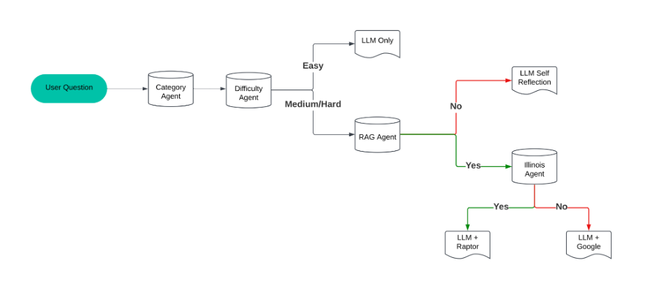

# Legal_LLM

## Our Project: Legal Advisory System
This project focuses on enhancing LLM performance on Legal questions by integrating advanced techniques such as **few-shot prompt engineering**, **Chain-of-Thought (CoT) prompting**, **ReAct**, **adaptive RAG**, and **RAPTOR**. Our system achieves a significant 110% improvement over baseline models on Illinois Law question-answering.

## The Workflow: 

### Our Agents:
* **Category Agent**: Determine the question (query) type according to LegalBench's taxonomy, and use the prompt in LegalBench.
* **Difficulty Agent**: Determine the query's difficulty level into [easy, medium, hard].
* **RAG Agent**: Determine if external information is helpful.
* **Illinois Agent**: Determine if the query is about Illinois Law.

### In general, there are two phrases in our workflow. 

#### [Phrase 1] is about **data enrichment/augmentation**, performance is the main concern: 
**Category Agent**: f(query) = query + category (and prompt of this specific task)  
**Difficulty Agent**: f(query, catgory) = one of {easy, medium, hard}  
By doing so, we enrich our input from "query" to (query, category, prompt, difficulty). The model performance are generally getting better because of the few-shot CoT prompt.  

#### [Phrase 2] is about **division of labor**, we care about both performance and efficiency in this phrase: 
With the difficulty-level information, we answer those "easy" questions directly without calling any other tools, to save time and energy.  
Then, there are two ways to improve the model performance - RAG and Self-reflection. Basically, self-reflection is a more universally useful solution, while RAG is only useful when external information is helpful. So, we need to ask the **RAG Agent** to see if we need external informaion from the RAG system, otherwise, it passes the data to the Self-reflection LLM.  
Since we only have Illinois Law data in our RAG database, we use **Illinois Agent** to determine if we want to retrieve documents from RAG or Google Search.  

## Benchmark Analysis: 

## Core Contributions:
* Benchmark knowledge-Informed Adaptive RAG:
Inspired by the Adaptive RAG paper, which fine-tuned an LLM classifier to dynamically adjust the retrieval strategy, we take this concept further. Our approach incorporates knowledge from public legal benchmarks (e.g., LegalBench) to enhance the accuracy of the LLM classifier via CoT prompt engineering. This allows the system to more effectively determine when to utilize RAG or other tools based on the predicted difficulty of the question.

* ReAct and advanced RAG for Complex Questions:
For questions classified as "hard", our system employs ReAct to promote deeper reasoning.  This involves strategically combining ReAct with techniques like RAPTOR, Google Search, and self-reflection to gather and synthesize relevant information. RAPTOR is essentially a data augmentation technique, it enhances RAG performance by clustering-summarizing to generate additional documents with high-level information. We rewrite the code of RAPTOR, optimized for GPU acceleration and parallelism to improve efficiency.

* The workflow of course.

## Limitations:
* We have only a part of Illinois Law documents in our RAG system.

## Future works:
* Fine tuning small LLM model to replace these agent for better running speed and accuracy.
* The RAPTOR code in the original paper does not explain why they are using UMAP and GMM. They are easy to use, no parameters to adjust, but super slow to run. Other dimensional reduction methods like Autoencoder, and Uncertainty Autoencoder can be possible alternatives to the UMAP algorithm. People generally not recommended to use AE on tabular dataset, but for NLP, maybe it's useful.
  
## Reference
> [1] Brown, T. B. (2020). Language models are few-shot learners. *arXiv preprint arXiv:2005.14165*.

> [2] Wei, J., Wang, X., Schuurmans, D., Bosma, M., Xia, F., Chi, E., ... & Zhou, D. (2022). Chain-of-thought prompting elicits reasoning in large language models. *Advances in Neural Information Processing Systems*, 35, 24824–24837.

> [3] Yao, S., Zhao, J., Yu, D., Du, N., Shafran, I., Narasimhan, K., & Cao, Y. (2022). React: Synergizing reasoning and acting in language models. *arXiv preprint arXiv:2210.03629*.

> [4] Jeong, S., Baek, J., Cho, S., Hwang, S. J., & Park, J. C. (2024). Adaptive-rag: Learning to adapt retrieval-augmented large language models through question complexity. *arXiv preprint arXiv:2403.14403*.

> [5] Sarthi, P., Abdullah, S., Tuli, A., Khanna, S., Goldie, A., & Manning, C. D. (2024). Raptor: Recursive abstractive processing for tree-organized retrieval. *arXiv preprint arXiv:2401.18059*.
